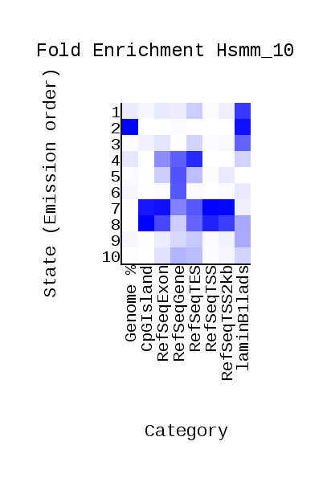

# Домашнее задание №3 (ChromHMM)

Ссылка на колаб: https://colab.research.google.com/drive/1WRd0rMHbZFfAZi9M8PMwnEaadoiP8hwZ?usp=sharing

## Таблица соответствия меток и файлов

|Номер|Название|Файл|
|---|---|---|
| 1 | H2az | H2az.bam |
| 2 | H3k27ac | H3k27ac.bam |
| 3 | H3k27me3 | H3k27me3.bam |
| 4 | H3k36me3 | H3k36me3.bam |
| 5 | H3k79me2 | H3k79me2.bam |
| 6 | H3k4me1 | H3k4me1.bam |
| 7 | H3k4me3 | H3k4me3.bam |
| 8 | H3k9ac | H3k9ac.bam |
| 9 | H3k9me3 | H3k9me3.bam |
| 10| H4k20me1 | H4k20me1.bam |

## Картинки из выдачи ChromHMM

## Скрины из геномного браузера

## Таблица соответствия состояний, свойств и гистоновых меток

|Номер|Название|Свойства|
|---|---|---|
| 1 | H3k9me3, H3k27me3 | Межгенное пространство, близок к концу генов|
| 2 | - |  Межгенное пространство|
| 3 | H3k9me3 |  Межгенное пространство, близок к концу генов|
| 4 | H3k79me2, H3k36me3 | Внутригенное пространство, близко к экзонам|
| 5 | H3k79me2 | Внутригенное пространство, обладает большой длиной|
| 6 | H3k79me2 | Внутригенное пространство, обладает большой длиной|
| 7 | H2az, H3k9ac, H3k27ac, H3k4me3 | Внутригенное пространство, близок к концу гена |
| 8 | H2az| Межгенное пространство, близок к концу и началу гена 
| 9 | H3k4me1 | Межгенное пространство |
| 10| H2az, H3k9ac, H3k27ac | Межгенное пространство |

## Таблица соответствия состояний и назначения в геноме

На основе изучения статей были сделаны следующие выводы:

|Номер|Название|Функция|
|---|---|---|
| 1 | H3k9me3, H3k27me3 | Repressed |
| 2 | - | Enhancer |
| 3 | H3k9me3 | Repressed |
| 4 | H3k79me2, H3k36me3 | Exon |
| 5 | H3k79me2 | Intron |
| 6 | H3k79me2 | Intron |
| 7 | H2az, H3k9ac, H3k27ac, H3k4me3 | Transcribed |
| 8 | H2az| Promotor |
| 9 | H3k4me1 | Transcribed |
| 10| H2az, H3k9ac, H3k27ac | Promotor |

Бонус:
Смотрите файл rename.py.

Скрин из геномного браузера:

